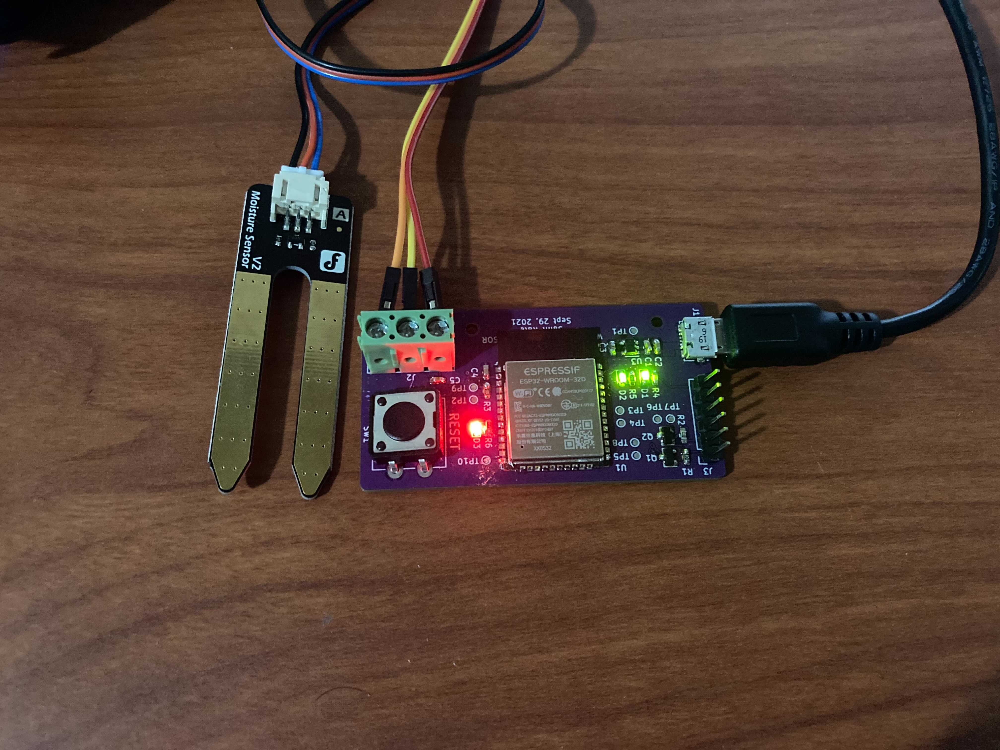

# Wireless-Soil-Moisture-Sensor

## Motivation
Currently, I fly out of a gliding club called SOSA. I've been flying longer than I've been driving, and it's a sport that brings something new to it every day. The airport from which SOSA flies out of is grass - combined with a rainy season and soft mud, it means we can't fly the gliders as they get stuck in the mud and leave ruts.

I've had to drive out many times just to discover that the field is too wet. I decided to make a wireless soil moisture sensor that would broadcast the how moist the soil was so that all members can see this.

## Implementation
I opted to use an ESP32 so I could embed the wireless communication inside the chip, meaning the entire system can be run off of a portable USB battery pack.

## Pictures

